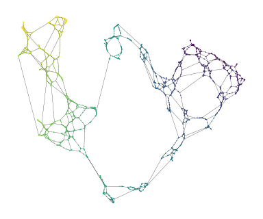
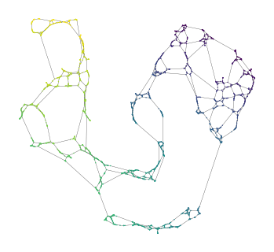
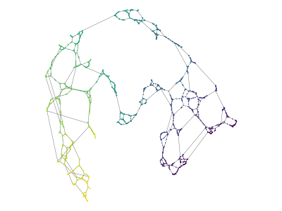

[](https://badge.fury.io/py/multi-mst)
[](https://github.com/vda-lab/multi_mst/actions/workflows/Tests.yml)
[](https://doi.org/10.5281/zenodo.13929036)

Manifold Modelling with Minimum Spanning Trees
==============================================

Dimensionality reduction (DR) algorithms typically assume the data they are
given is uniformly sampled from some underlying manifold. When this is not the
case, and there are observation-gaps along the manifold, these algorithms may
fail to detect a single connected component. This repository presents two
manifold approximation approaches for non-uniform sampled data that always
construct a single connected component by building upon minimum spanning trees
(MST).

Their main use-case is as input to dimensionality reduction algorithms for data
visualization. This repository supports UMAP, where our manifold models improve
projection and visualization quality at low number of neighbors. Additionally,
our fast (approximate) minimum spanning tree construction algorithms can be used
to speed up HDBSCAN (and other hierarchical) clustering.


Noisy Minimum Spanning Tree Union
---------------------------------

The noisy minimum spanning tree union ($n$-MST) is inspired by Pathfinder
networks that, with a specific parameter selection, yield the union set of all
possible MSTs in a network (see, e.g., [[1]], [[2]]). We compute noisy MSTs to
detect alternative connectivity at all distance scales for distances which may
have few identically weighted connections.

We add Gaussian noise ($\mu=0$) to every candidate edge. The noise parameter $n$
is specified as a fraction of the points' nearest neighbor distance and
controls the Gaussian's standard deviation. This formulation makes the noise
scale with the data's density to avoid adding more edges in dense regions than
sparse regions, retaining a reasonably uniform manifold approximation graph.

```python
import matplotlib.pyplot as plt
import matplotlib.collections as mc
from sklearn.datasets import make_swiss_roll
from multi_mst import NoisyMST

X, t = make_swiss_roll(n_samples=2000, noise=0.5, hole=True)
model = NoisyMST(num_neighbors=10, noise_fraction=1.0).fit(X)
projector = model.umap(repulsion_strength=1.0)

# Drawing the network
xs = projector.embedding_[:, 0]
ys = projector.embedding_[:, 1]
coo_matrix = projector.graph_.tocoo()
sources = coo_matrix.row
targets = coo_matrix.col

plt.figure(figsize=(4, 3))
plt.scatter(xs, ys, c=t, s=1, edgecolors="none", linewidth=0, cmap="viridis")
lc = mc.LineCollection(
    list(zip(zip(xs[sources], ys[sources]), zip(xs[targets], ys[targets]))),
    linewidth=0.2,
    zorder=-1,
    alpha=0.5,
    color="k",
)
ax = plt.gca()
ax.add_collection(lc)
ax.set_aspect("equal")
plt.subplots_adjust(0, 0, 1, 1)
plt.axis("off")
plt.show()
```


$k$-Nearest Minimum Spanning Tree 
---------------------------------

The k-nearest Minimum Spanning Tree ($k$-MST) generalizes $k$-nearest neighbor
networks ($k$-NN) to minimum spanning trees. It adds the $k$ shortest edges
between components. Since data points start as distinct components, all $k$-NN
edges are included in the kMST. This approach is faster than the noisy minimum
spanning tree union because it runs the Boruvka algorithm only once.

To avoid creating shortcuts in the manifold, a distance threshold $\epsilon$ can
be applied. The parameter is specified as a fraction of the shortest edge
between components and provides an upper distance limit for the $2$-to-$k$
alternative edges.

```python
import matplotlib.pyplot as plt
import matplotlib.collections as mc
from sklearn.datasets import make_swiss_roll
from multi_mst import KMST

X, t = make_swiss_roll(n_samples=2000, noise=0.5, hole=True)
model = KMST(num_neighbors=3, epsilon=2.0).fit(X)
projector = model.umap(repulsion_strength=1.0)

# Drawing the network
xs = projector.embedding_[:, 0]
ys = projector.embedding_[:, 1]
coo_matrix = projector.graph_.tocoo()
sources = coo_matrix.row
targets = coo_matrix.col

plt.figure(figsize=(4, 3))
plt.scatter(xs, ys, c=t, s=1, edgecolors="none", linewidth=0, cmap="viridis")
lc = mc.LineCollection(
    list(zip(zip(xs[sources], ys[sources]), zip(xs[targets], ys[targets]))),
    linewidth=0.2,
    zorder=-1,
    alpha=0.5,
    color="k",
)
ax = plt.gca()
ax.add_collection(lc)
ax.set_aspect("equal")
plt.subplots_adjust(0, 0, 1, 1)
plt.axis("off")
plt.show()
```



Approximate $k$-MST
-------------------

Computing $k$-MSTs using KDTrees can be expensive on some datasets. We provide a
version of the algorithm based on Nearest Neighbor Descent for quicker
approximations. We combined Boruvka's algorithm with NNDescent to find neighbors
that are not already connected in the MST being build. This variant supports all
distance metrics implemented in `pynndescent`. Combined with `fast_hdbscan`'s
cluster selection, it can greatly speed up computing (approximate) clusters on
high dimensional data-sets!


```python
import matplotlib.pyplot as plt
import matplotlib.collections as mc
from sklearn.datasets import make_swiss_roll
from multi_mst import KMSTDescent

X, t = make_swiss_roll(n_samples=2000, noise=0.5, hole=True)
model = KMSTDescent(num_neighbors=3, epsilon=2.0).fit(X)
projector = model.umap(repulsion_strength=1.0)

# Draw the network
xs = projector.embedding_[:, 0]
ys = projector.embedding_[:, 1]
coo_matrix = projector.graph_.tocoo()
sources = coo_matrix.row
targets = coo_matrix.col

plt.figure(figsize=(4, 3))
plt.scatter(xs, ys, c=t, s=1, edgecolors="none", linewidth=0, cmap="viridis")
lc = mc.LineCollection(
    list(zip(zip(xs[sources], ys[sources]), zip(xs[targets], ys[targets]))),
    linewidth=0.2,
    zorder=-1,
    alpha=0.5,
    color="k",
)
ax = plt.gca()
ax.add_collection(lc)
ax.set_aspect("equal")
plt.subplots_adjust(0, 0, 1, 1)
plt.axis("off")
plt.show()
```



Supported Tasks
---------------

All three approaches support several downstream tasks.

```python
# Dimensionality reduction
# - Creates fitted UMAP or TSNE models from the computed manifold graph.
projector = model.umap(n_components=2) # or
projector = model.tsne(n_components=2)

# Graph layouts
# - Computes a 2D graph layout using (py)graphviz and networkx.
embedding = model.graphviz_layout(prog="sfdp")

# HDBSCAN or HBCC clusters
# - Creates a fitted HDBSCAN or HBCC model from the computed manifold graph.
# - Computes mutual-reachability from the model's number of neighbors.
clusterer = model.hdbscan(cluster_selection_method='leaf') # or
clusterer = model.hbcc(cluster_selection_method='leaf')

# Sub-cluster detectors
# - Ensures parameter and distance metric combinations are valid!
branch_detector = model.branch_detector(clusterer, min_cluster_size=5)
bc_detector = model.boundary_cluster_detector(clusterer, min_cluster_size=5)

# Accessors for the manifold graph
# - Mutual-reachability computed from the model's number of neighbors.
model.graph_                       # CSR format, rows sorted by distance
model.mutual_reachability_graph_   # CSR format, rows sorted by mutual reachability
model.minimum_spanning_tree_       # Edgelist, unsorted 
model.mutual_reachability_tree_    # Edgelist, unsorted
model.knn_neighbors_               # Adjacency lists for k-NN sorted by distance
model.knn_distances_               # Adjacency lists for k-NN sorted by distance
model.graph_neighbors_             # Adjacency lists for graph sorted by distance, -1 = missing
model.graph_distances_             # Adjacency lists for graph sorted by distance, inf = missing
```

The demonstration notebooks in `./notebooks` provide more elaborate examples.


Installation Instructions
-------------------------

The `multi_mst` package can be installed from pypi:

```bash
pip install multi_mst
```

Acknowledgements
----------------

Most code---including the numba KDTree, disjoint set and Boruvka MST
construction implementation---is adapted from
[fast_hdbscan](https://github.com/TutteInstitute/fast_hdbscan).


License
-------

`multi_mst` uses the same license as `fast_hdbscan`: BSD (2-clause). See the
LICENSE file for details.


[1]: <https://onlinelibrary.wiley.com/doi/10.1002/asi.20904> "Pathfinder Networks"
[2]: <https://ieeexplore.ieee.org/document/8231853> "GraphRay"
