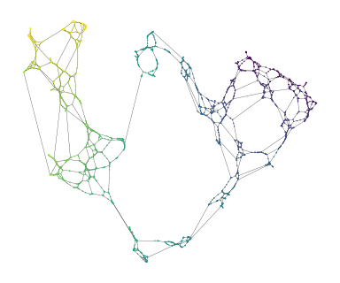
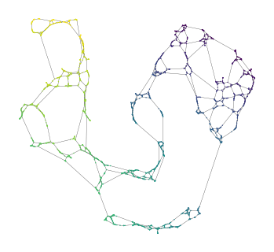

==============================================
Manifold Modelling with Minimum Spanning Trees
==============================================

Dimensionality reduction (DR) algorithms typically assume the data they are
given is uniformly sampled from some underlying manifold. When this is not the
case, and there are observation-gaps along the manifold, these algorithms may
fail to detect a single connected entity. This repository presents two manifold
approximation approaches based on minimum spanning trees (MST) for non-uniform
sampled data. 

---------------------------------
Noisy Minimum Spanning Tree Union
---------------------------------

The noisy minimum spanning tree union ($n$-MST) is inspired by Pathfinder
networks that, with a specific parameter selection, yield the union set of all
possible MSTs in a network (see, e.g., [`1`_], [`2`_]). We compute noisy MSTs to
detect alternative connectivity at all distance scales for distances which may
have few identically weighted connections.

We add Gaussian noise ($\mu=0$) to every candidate edge. The noise parameter $n$
is specified as a fraction of the points' nearest neighbour distance and
controls the Gaussian's standard deviation. This formulation makes the noise
scale with the data's density to avoid adding more edges in dense regions than
sparse regions, retaining a reasonably uniform manifold approximation graph.

.. code:: python

    import matplotlib.pyplot as plt
    import matplotlib.collections as mc
    from sklearn.datasets import make_swiss_roll
    from multi_mst.noisy_mst import NoisyMST

    X, t = make_swiss_roll(n_samples=2000, noise=0.5, hole=True)
    projector = NoisyMST(num_trees=10, noise_fraction=1.0).fit(X)

    # Draw the network
    xs = projector.embedding_[:, 0]
    ys = projector.embedding_[:, 1]
    coo_matrix = projector.graph_.tocoo()
    sources = coo_matrix.row
    targets = coo_matrix.col

    plt.figure(figsize=(4, 3))
    plt.scatter(xs, ys, c=t, s=1, edgecolors="none", linewidth=0, cmap="viridis")
    lc = mc.LineCollection(
        list(zip(zip(xs[sources], ys[sources]), zip(xs[targets], ys[targets]))),
        linewidth=0.2,
        zorder=-1,
        alpha=0.5,
        color="k",
    )
    ax = plt.gca()
    ax.add_collection(lc)
    ax.set_aspect("equal")
    plt.subplots_adjust(0, 0, 1, 1)
    plt.axis("off")
    plt.show()

---------------------------------
$k$-Nearest Minimum Spanning Tree 
---------------------------------

The k-nearest Minimum Spanning Tree ($k$-MST) generalises $k$-nearest neighbour
networks ($k$-NN) for minimum spanning trees. It adds the $k$ shortest edges
between components. Since data points start as distinct components, all $k$-NN
edges are included in the kMST.  

To avoid creating shortcuts in the manifold, a distance threshold $\epsilon$ can
be applied. The parameter is specified as a fraction of the shortest edge
between components and provides an upper distance limit for the $2$-to-$k$
alternative edges.

.. code:: python

    import matplotlib.pyplot as plt
    import matplotlib.collections as mc
    from sklearn.datasets import make_swiss_roll
    from multi_mst.k_mst import KMST

    X, t = make_swiss_roll(n_samples=2000, noise=0.5, hole=True)
    projector = KMST(num_neighbors=3, epsilon=2.0).fit(X)

    # Draw the network
    xs = projector.embedding_[:, 0]
    ys = projector.embedding_[:, 1]
    coo_matrix = projector.graph_.tocoo()
    sources = coo_matrix.row
    targets = coo_matrix.col

    plt.figure(figsize=(4, 3))
    plt.scatter(xs, ys, c=t, s=1, edgecolors="none", linewidth=0, cmap="viridis")
    lc = mc.LineCollection(
        list(zip(zip(xs[sources], ys[sources]), zip(xs[targets], ys[targets]))),
        linewidth=0.2,
        zorder=-1,
        alpha=0.5,
        color="k",
    )
    ax = plt.gca()
    ax.add_collection(lc)
    ax.set_aspect("equal")
    plt.subplots_adjust(0, 0, 1, 1)
    plt.axis("off")
    plt.show()

-------------------------
Installation Instructions
-------------------------

The `multi_mst` package can be installed from pypi:

.. code:: bash

    pip install multi_mst

----------------
Acknowledgements
----------------

Most code---including the numba KDTree, disjoint set and boruvka MST
construction implementation---is adapted from `fast_hdbscan`_.

-------
License
-------

`multi_mst` uses the same license as `fast_hdbscan`: BSD (2-clause). See the
LICENSE file for details.

.. _1: https://onlinelibrary.wiley.com/doi/10.1002/asi.20904
.. _2: https://ieeexplore.ieee.org/document/8231853
.. _fast_hdbscan: https://github.com/TutteInstitute/fast_hdbscan